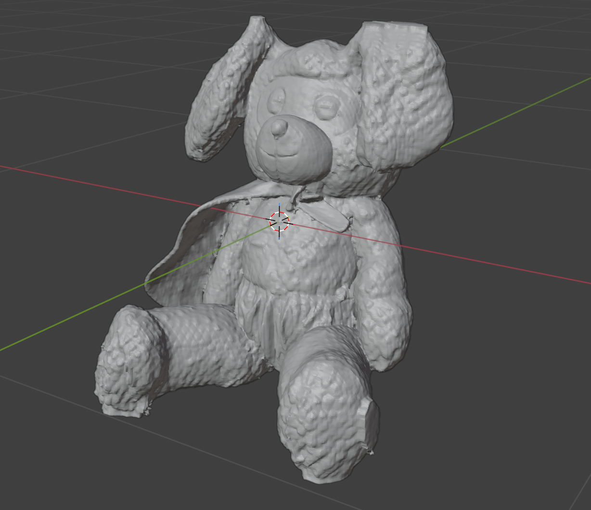
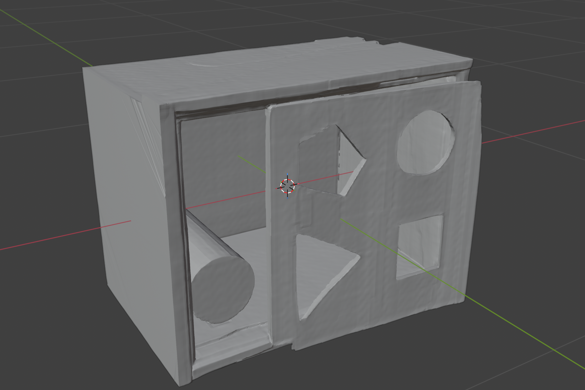

# SAM 3D Objects for Apple Silicon

Turn a single photo into a 3D object on a Mac. This is a native Apple-Silicon
port of Meta AI's **SAM 3D Objects** — it runs the full single-image
reconstruction pipeline on the GPU via Metal Performance Shaders (MPS) plus
custom Metal compute kernels, with no CUDA required.

It ships two ways:

- **A packaged macOS app** — an interactive desktop application: drop in an
  image, click points to segment the object with SAM, and reconstruct a
  textured 3D model that you can orbit, inspect, and export.
- **A command-line tool** (`main.py`) for scripted / batch reconstruction.

Outputs include watertight **GLB meshes** (per-vertex color or baked UV
texture atlas) and real **3D Gaussian-Splatting `.ply`** files.

**Original Image**
<p align="left">
  
</p>

<table>
<tr>
<th>Mask</th>
<th>3D Reconstruction</th>
</tr>
<tr>
<td></td>
<td></td>
</tr>
<tr>
<td></td>
<td></td>
</tr>
</table>

Using **SAM 3D** by Meta AI:
- [Paper (arXiv)](https://arxiv.org/abs/2511.16624)
- [Official GitHub](https://github.com/facebookresearch/sam-3d-objects)
- [Model Weights (Hugging Face)](https://huggingface.co/facebook/sam-3d-objects)

## Features

- **Interactive segmentation** — SAM point-prompt masking in the browser UI
  (positive / negative clicks), no manual mask files needed.
- **Single-image 3D reconstruction** — geometry + appearance from one photo.
- **Multiple output formats:**
  - `GLB` mesh with **per-vertex color** (default).
  - `GLB` mesh with a **baked UV texture atlas** (portable, no CUDA / nvdiffrast).
  - Real **3D Gaussian-Splatting `.ply`** for depth-ambiguous / soft previews.
- **Scene placement (pose + layout)** — optionally position the reconstructed
  object in real-world camera space using the model's predicted pose, with an
  optional pointmap/mask-guided refinement pass. Emits a `*_placed.glb`
  alongside the canonical mesh.
- **Apple-Silicon native** — MPS backend plus hand-written Metal kernels for
  sparse convolution and flash attention.
- **Low-memory pipeline** — sequential stage loading and SLAT caching to fit in
  ~48 GB unified memory.
- **Live progress** — streamed pipeline logs and an in-place mask → model
  preview in the web app.

## Two ways to run

### 1. Desktop app (interactive web UI)

The app is a FastAPI server that serves an interactive single-page UI
(`static/index.html`). Start it and open the browser UI:

```bash
conda activate sam-3d-mlx
python server.py
# then open http://localhost:8000
```

Workflow: upload an image → click points to segment the object → pick a quality
preset → reconstruct → orbit the result and download **GLB** or **PLY**.

To place the object in real-world camera space, tick **Place in scene** before
reconstructing (and optionally **Refine** for a slower, pointmap-guided pose
pass). The result view then offers a **View placed / View object** toggle and a
placed-GLB download.

Optional Gaussian-splat export is on by default; disable it with
`SAM3D_SPLAT=0`.

### 2. Command line

```bash
conda activate sam-3d-mlx
python main.py \
    --image images/shutterstock_stylish_kidsroom_1640806567/image.png \
    --mask-dir images/shutterstock_stylish_kidsroom_1640806567 \
    --mask-index 0 \
    --mesh \
    --output outputs/reconstruction.glb
```

#### Key Arguments
| Argument | Description |
|----------|-------------|
| `--image` | Input image path |
| `--mask` / `--mask-dir` + `--mask-index` | Object mask (single file or SAM-style directory) |
| `--mesh` | Output a smooth GLB mesh (otherwise voxel STL) |
| `--steps` | Stage-2 (SLAT texture & refinement) flow-matching steps (default: 12). Stage 2 is genuine flow matching and is not distilled. |
| `--ss-steps` | Stage-1 (sparse-structure / geometry) steps (default: 2). This stage is **shortcut-distilled** in the shipped weights, so 2 steps is the intended default; values above 4 rarely help. |
| `--ss-distill` / `--no-ss-distill` | Use shortcut-distilled sampling for stage 1 (step-size conditioning, CFG-free, ~1 eval/step). On by default and required for the low `--ss-steps` to be valid; pass `--no-ss-distill` to fall back to CFG flow matching (then use ~12 steps). |
| `--distill` | Also distill **stage 2** (SLAT). The released SLAT weights are not shortcut-distilled, so this is experimental and usually degrades texture; leave it off. |
| `--simplify` | Mesh decimation ratio (`0.0` = none … `0.95` = heavy) |
| `--vertex-color-source` | `gaussian` (saturated, recommended) or `mesh` |
| `--bake` | Bake a UV texture atlas instead of per-vertex color |
| `--bake-source` | `gaussian` (higher fidelity) or `vertex` |
| `--texture-size` | Baked atlas edge length in px (default: 2048) |
| `--layout` | Also emit a scene-placed `<output>_placed.glb` (object posed in camera space) |
| `--layout-refine` | With `--layout`, refine the pose against the pointmap + mask (ICP + render-compare; slower, CPU) |
| `--cache-dir` / `--load-slat` | Cache / reuse intermediate SLAT to skip stages 0–2 |
| `--output` `-o` | Output file (`.glb`, `.stl`) |

#### Scene placement (pose + layout)

By default the mesh is exported in canonical object space (centered, unit-ish
scale). Pass `--layout` to also write a `<output>_placed.glb` that positions the
object in real-world **camera space** using the pose the model predicts:

```bash
python main.py \
    --image images/shutterstock_stylish_kidsroom_1640806567/image.png \
    --mask-dir images/shutterstock_stylish_kidsroom_1640806567 \
    --mask-index 0 \
    --mesh --layout --layout-refine \
    --output outputs/reconstruction.glb
# writes outputs/reconstruction.glb (canonical) + outputs/reconstruction_placed.glb (posed)
```

What each step does:

1. **Pose prediction** — the sparse-structure stage already predicts an object
   rotation, translation, and scale (relative to the camera); these are decoded
   into a placement transform.
2. **Placement (`--layout`)** — the transform (z-up → y-up basis change, then
   scale / rotate / translate) is applied to the exported mesh, so the object
   sits where it was observed in the photo. The canonical mesh is always kept.
3. **Refinement (`--layout-refine`, optional)** — refines the pose against the
   MoGe pointmap and the object mask: manual point-cloud alignment → shape ICP →
   a render-and-compare silhouette optimization (reported as a layout IoU). Runs
   on CPU and is slower; without it, placement just uses the raw predicted pose.

Placement never blocks the main path: if pose or refinement fails, the canonical
mesh is still produced. Both `--layout` flags have equivalents in the web UI
(**Place in scene** / **Refine**).

## Installation

1. **Clone and create the environment** (a conda env is recommended for
   PyTorch3D C++/ABI compatibility):
   ```bash
   git clone <this-repo>
   cd Sam3D-Objects-MLX
   conda create -n sam-3d-mlx python=3.11
   conda activate sam-3d-mlx
   uv pip install -e .        # or: uv sync
   ```

2. **Download checkpoints** from
   [Hugging Face](https://huggingface.co/facebook/sam-3d-objects) into
   `checkpoints/hf/` (the `pipeline.yaml` plus all `.pt` / `.safetensors`
   weights). These weights are governed by Meta's SAM License — see
   [Licensing](#licensing).

3. **Environment variables** (set automatically by `main.py` / `server.py`, but
   useful when running manually):
   ```bash
   export SPARSE_BACKEND=mps
   export SPARSE_ATTN_BACKEND=sdpa
   export PYTORCH_MPS_HIGH_WATERMARK_RATIO=0.0
   ```

## Structure
```
main.py             # CLI entry point
server.py           # FastAPI interactive web app
static/index.html   # Single-page UI (segmentation + viewer)
splat_export.py     # Optional Gaussian-splat (.ply) export module
texture_baking.py   # UV texture-atlas baking (portable, no CUDA)
sam3d_objects/       # Core model + pipeline (Apple-Silicon port)
checkpoints/hf/     # Model weights (download from Hugging Face)
images/             # Example images + masks
outputs/            # Reconstruction results
.cache/             # Cached intermediate latents (SLAT)
```

## How the port works

This project adapts the original CUDA-based
[SAM 3D Objects](https://github.com/facebookresearch/sam-3d-objects) pipeline to
Apple Silicon:

1. **Removed CUDA dependencies** — replaced `spconv-cu121`, `xformers`, and other
   CUDA-only packages.
2. **[MPS backend](https://developer.apple.com/metal/pytorch/)** — model loading
   and inference rewired onto PyTorch's Metal Performance Shaders.
3. **Metal sparse convolution** — custom Metal compute kernels for voxel
   processing:
   - [`sparse_conv.metal`](sam3d_objects/model/backbone/tdfy_dit/modules/sparse/conv/sparse_conv.metal)
   - [`conv_metal.py`](sam3d_objects/model/backbone/tdfy_dit/modules/sparse/conv/conv_metal.py)
4. **Metal flash attention** — GPU-accelerated attention for the sparse
   transformers:
   - [`flash_attn.metal`](sam3d_objects/model/backbone/tdfy_dit/modules/sparse/attention/flash_attn.metal)
   - [`metal_flash_attn.py`](sam3d_objects/model/backbone/tdfy_dit/modules/sparse/attention/metal_flash_attn.py)
5. **[Low-memory pipeline](sam3d_objects/pipeline/inference_pipeline_low_memory.py)**
   — sequential stage loading and chunked decoding to run within 48 GB of
   unified memory.
6. **Portable appearance** — Gaussian-splat export and a PyTorch3D-based UV
   texture baker replace the original CUDA/nvdiffrast texturing path.
7. **Shortcut-distilled stage 1** — the sparse-structure stage ships as a
   *shortcut* model (step-size-conditioned, CFG-free). It is now sampled that way
   by default (`--ss-steps 2 --ss-distill`), decoupled from the stage-2 SLAT step
   count. Earlier revisions of this port ran stage 1 as plain CFG flow matching
   with the stage-2 step count, which both wasted evals and did not match the
   shipped configuration. See the [CHANGELOG](CHANGELOG.md).

## Troubleshooting

### `ImportError: Symbol not found`
PyTorch3D's compiled C++ extensions must match PyTorch's ABI. Use the conda
environment (with PyTorch3D built to match) rather than an ad-hoc `.venv`:
```bash
rm -rf .venv
conda activate sam-3d-mlx
python main.py ...
```

### Metal GPU segmentation faults
The default sparse backend is MPS (PyTorch-native Metal), which is stable. If
you experiment with other backends:
```bash
SPARSE_BACKEND=mps    SPARSE_ATTN_BACKEND=sdpa python main.py ...   # default
SPARSE_BACKEND=spconv SPARSE_ATTN_BACKEND=sdpa python main.py ...   # pure CPU
```

## Licensing

This project uses an **open-core** model, similar to MongoDB: the source is
released under a strong copyleft license, while certain components are protected
IP available under a separate commercial license.

- **Open source (AGPL-3.0).** The application source in this repository is
  licensed under the **GNU Affero General Public License v3.0** (see
  [`LICENSE`](LICENSE)). Because the AGPL's network clause applies, if you run a
  modified version of this software to provide a service over a network, you
  must make your complete corresponding source available to the users of that
  service under the same license.

- **Protected IP / commercial license.** Some modules are proprietary and are
  **not** granted under the AGPL for closed-source or SaaS use. A **commercial
  license** is available that (a) lifts the AGPL's copyleft and network
  source-disclosure obligations and (b) grants rights to the protected
  components for embedding in proprietary products or the packaged macOS app.
  Contact the maintainers to obtain a commercial license.

- **Model weights (Meta SAM License).** The SAM 3D model weights and the code
  under [`sam3d_objects/`](sam3d_objects/LICENSE) are provided by Meta under the
  **SAM License** and remain subject to Meta's terms and acceptable-use policy.
  They are **not** covered by this project's AGPL or commercial grant — you must
  obtain and use them directly under Meta's license.

If you are unsure which license applies to your use case (e.g. shipping the
packaged app, offering a hosted service, or embedding the pipeline in a
proprietary product), please reach out before distribution.

