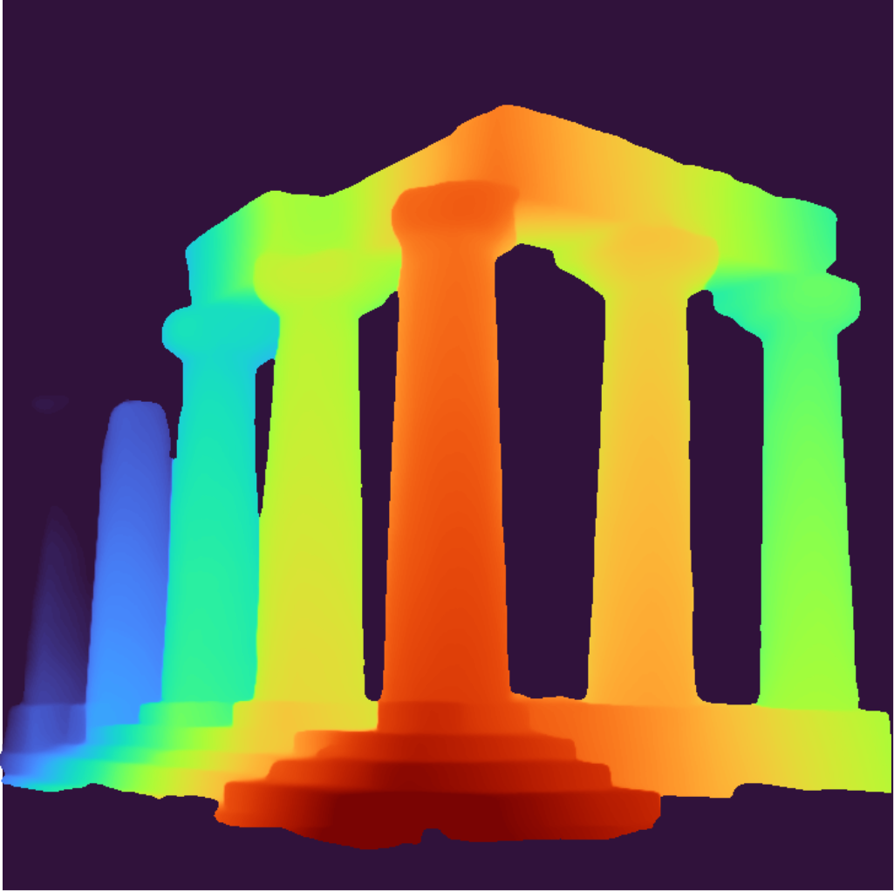
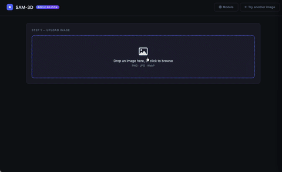
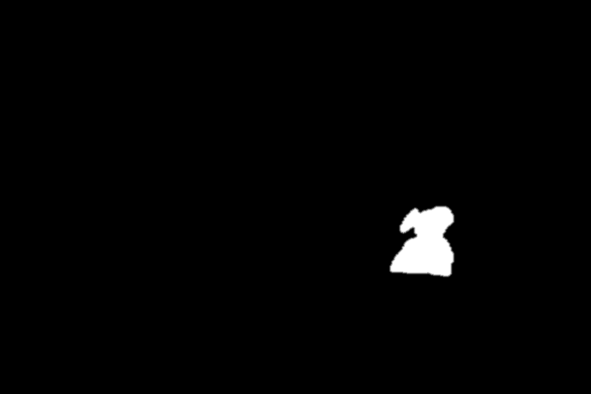
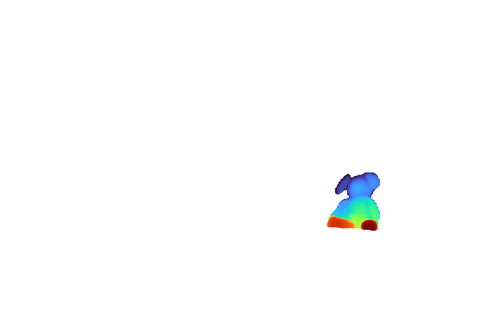
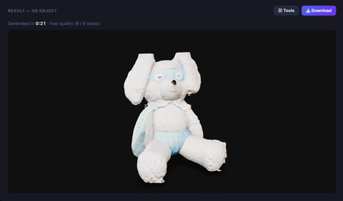

# PYTHIA: SAM 3D Objects for Apple Silicon



Turn a single photo into a 3D object on a Mac. This is a native Apple-Silicon port of Meta AI's **SAM 3D Objects**. Segmentation (SAM) and depth (MoGe) run on the GPU via Metal Performance Shaders (MPS); the 3D generative reconstruction stages run on the CPU, with no CUDA required.

It ships two ways:

- **A packaged macOS app**: an interactive desktop application. Drop in an
  image, segment the object with SAM, and reconstruct a textured 3D model that
  you can orbit, inspect, and export.
- **A command-line tool** (`main.py`) for scripted and batch reconstruction.

Outputs include watertight **GLB meshes** (per-vertex color or baked UV texture
atlas), real **3D Gaussian-Splatting `.ply`** files, and - from the web UI -
`glTF`, `USDZ`, `PLY`, `OBJ`, and `STL`, with in-browser mesh cleanup, color
grading, stencil trimming, decimation, and GLB compression.

## Demo

Full pipeline on an M1 Mac - under a minute for simple models:



**Original image**

<p align="left">
  
</p>

<table>
<tr>
<th>2D mask ("teddy bear")</th>
<th>Depth mask</th>
</tr>
<tr>
<td></td>
<td></td>
</tr>
</table>

**Reconstructed model**



Using **SAM 3D** by Meta AI:
- [Paper (arXiv)](https://arxiv.org/abs/2511.16624)
- [Official GitHub](https://github.com/facebookresearch/sam-3d-objects)
- [Model Weights (Hugging Face)](https://huggingface.co/facebook/sam-3d-objects)

## Requirements

| | |
|---|---|
| **Hardware** | Apple Silicon Mac, M-series (M1 or later) |
| **Memory** | **24 GB unified memory** |
| **OS** | macOS 13+ |
| **Python** | 3.11 (conda recommended) |

**Not supported:**

- **Intel Macs.** SAM segmentation and MoGe depth require the Metal Performance
  Shaders (MPS) backend, which is Apple-Silicon only.
- **A-series Macs** (e.g. the MacBook "Neo" class). Insufficient unified memory
  for the working set.
- **iPadOS / iOS.** No general-purpose Python runtime.

### Memory profile

Sustained usage is around 8 to 9 GB. Peak stays **under 20 GB** and occurs late
in the pipeline, during mesh decoding and export, after the GPU generative
stages have finished and released their buffers. There is no configuration that
needs 48 GB; a 24 GB machine has comfortable headroom.

### Why Apple Silicon

Segmentation (SAM) and depth (MoGe) run on the GPU through Metal Performance
Shaders, so an MPS-capable Apple-Silicon GPU is required. Reconstruction then
expands a sparse voxel structure into a high-resolution mesh on the CPU, and the
transient working set for that step is large. Apple's **unified memory** puts
the GPU segmentation/depth stages and the CPU-side reconstruction transients in
one pool, so a 24 GB Mac holds both comfortably without a separate VRAM ceiling.

### Recommended configurations

| Machine | Unified memory | Notes |
|---|---|---|
| **Mac mini (M4 Pro)** | 24 GB | Cheapest supported configuration |
| **MacBook Pro (M-series Pro/Max)** | 24 to 48 GB | Portable; more headroom for other apps |
| **Mac Studio (M-series Max/Ultra)** | 64 GB+ | Fastest; ample headroom |

## Features

### ⚠️ Multi-view reconstruction (experimental)

Multi-view 3D reconstruction fuses geometry and appearance from 2+ images for improved shape completeness and texture quality. It is **fully implemented**, **re-enabled for testing** in the web UI, CLI, and API, and now includes **improved texture mapping and occlusion handling**.

**Web UI:** Toggle "Multi-View" mode in Step 1, upload 2+ images, segment each, then reconstruct.

**CLI usage:**
```bash
python main.py --multi-view --image-dir <images_directory> --masks-dir <masks_directory> --output output.glb
```

**API usage:**
```bash
POST /reconstruct_multi_view
```
with multiple images in the request body.

**Multi-view features:**
- Processes each view independently (full pipeline per view)
- **Fuses sparse geometry** via coordinate averaging across all views
- **Fuses appearance (gaussians)** with confidence-weighted blending
- **Occlusion-aware weighting**: Views with clearer/more consistent reconstructions contribute more
- Stage 2 MPS acceleration applies to **each view** separately
- Supports fusion modes: `stochastic` (random view per step) or `multidiffusion` (all views per step)
- Supports view weighting: `uniform` (equal) or `entropy` (prioritize consistent views)

**Multi-view with MPS control and fusion config:**
```bash
# MPS enabled (default), uniform view weighting
python main.py --multi-view --image-dir ... --output output.glb

# MPS disabled
python main.py --multi-view --image-dir ... --no-stage2-mps --output output.glb
```

**Texture mapping improvements:**
- ✅ Gaussian appearance fusion: Colors and covariances from all views are blended with confidence weights
- ✅ Per-view confidence weights: Views with clearer geometry contribute more to final appearance
- ✅ Occlusion-aware blending: Prioritizes well-reconstructed views, reduces artifacts from ambiguous regions
- ✅ Reduced seams and ghosting: Confident views dominate; uncertain views contribute less

**Performance notes:**
- Peak memory ~1.5× single-view due to per-view Stage 2 on MPS
- Each view's Stage 2 runs independently on MPS when enabled
- Geometry fusion happens on CPU (no device conflicts)
- Appearance fusion adds ~50-100ms per view

**Advanced usage (Web API with custom fusion config):**
```bash
curl -X POST http://localhost:8005/reconstruct_multi_view \
  -H "Content-Type: application/json" \
  -d '{
    "images": [...],
    "stage2_mps": true,
    "fusion_config": {
      "view_weighting": "entropy"
    }
  }'
```

**View weighting modes:**
- `uniform`: All views contribute equally (default, fast)
- `entropy`: Views with lower reconstruction uncertainty contribute more (better quality, slightly slower)

### Stage 2 MPS Acceleration (Default)

Stage 2 (SLAT texture & refinement) runs on Apple Silicon's Metal GPU (MPS) **by default** for improved speed. This uses standard PyTorch gather-scatter operations compatible with MPS—no custom Metal kernels required.

**To disable MPS and use CPU-only:**
```bash
conda activate sam-3d
python main.py --image <path> --mask-dir <masks> --no-stage2-mps --output output.glb
```

**Web API (disable MPS per-request):**
Pass `"stage2_mps": false` in the `/reconstruct` or `/reconstruct_multi_view` POST request to disable for that request:
```json
{
  "image_id": "...",
  "mask_b64": "...",
  "stage2_mps": false
}
```

**Server startup:**
```bash
# MPS enabled (default)
python server.py

# MPS disabled
python server.py --no-stage2-mps
```

**Notes:**
- MPS is enabled by default for best performance on Apple Silicon
- Falls back to CPU automatically if MPS is unavailable
- Does not affect Stage 1 (sparse geometry) or decoding stages
- Uses TRELLIS.2 sparse convolution pattern with gather-scatter operations

### Low-memory pipeline improvements

The low-memory inference pipeline (`InferencePipelineLowMemory`) has been refactored for **robustness and clarity**:

**Device coordination fixes:**
- Fixed Stage 2 MPS device handling to prevent tensor device mismatches
- Centralized device selection logic (new `get_stage2_device()` helper)
- Explicit tensor migration: inputs moved to stage2_device before generation, SLAT moved back to base device after

**Memory & I/O optimizations:**
- Single SLAT save (eliminated redundant double saves)
- Improved model cleanup with proper CPU transition before deletion
- MPS cache clearing with error handling

**Robustness enhancements:**
- Comprehensive error handling around model loading and caching
- Graceful fallbacks (e.g., use vertex color if Gaussian unavailable)
- Better logging with stage-specific prefixes (`[S0]`, `[S1]`, `[S2]`, `[S3]`)
- Clearer per-stage timing output with device info

**Developer experience:**
- Complete docstrings and type hints
- Organized code sections (memory utilities, caching, pipeline logic)
- Clear comments and timing checkpoints throughout

These improvements maintain full **backward compatibility** and don't change the external API or behavior—just the internal robustness and maintainability.

### Reconstruction

- **Interactive segmentation.** Two prompt modes in the browser UI: **text /
  concept** masking with **SAM 3** (describe the object, e.g. "chair") and
  **point-prompt** masking with **SAM 2** (positive / negative clicks). No manual
  mask files needed.
- **Single-image 3D reconstruction.** Geometry and appearance from one photo.
- **Apple-Silicon native.** SAM segmentation and MoGe depth run on the MPS
  backend; the 3-D reconstruction stages run on the CPU. No CUDA required.
- **Fast.** Native-resolution reconstruction in about a minute on M-series
  hardware (see [Geometry resolution](#geometry-resolution)).
- **Low-memory pipeline.** Sequential stage loading and SLAT caching keep the
  working set small (see [Requirements](#requirements)).
- **Watertight output.** Hole filling and floater removal run by default, so the
  exported GLB is closed, suitable for 3D printing, boolean operations, and
  volume computation.
- **Live progress.** Streamed pipeline logs and an in-place mask to model
  preview in the web app.

### Model management (web UI)

A **Models** panel (top-right of the web app) shows the models the app uses and
lets you fetch them without touching the command line:

- **Live status.** Each model reports **Loaded** (in memory), **Downloaded** (on
  disk), or **Missing**, with its on-disk size. The active 2-D segmentation
  model also shows a live "loading into memory" bar (it is loaded on demand, and
  the text model is preloaded as soon as you upload an image).
- **One-click downloads.** Missing models download in the background with a live
  progress indicator; the panel polls until each finishes.
- **Hugging Face access built in.** Paste a Hugging Face access token in the
  panel to authenticate; it is validated and used for gated downloads.
- **Gated-model handling.** **SAM 3** (text segmentation) and **SAM 3D Objects**
  are gated behind Meta approval; if access has not been granted the panel shows
  an actionable message linking straight to the request-access page (approval
  itself still happens on Hugging Face). SAM 2 and MoGe are public and download
  without a token.

### In-browser mesh tuning (web UI)

All edits are **non-destructive** (the source mesh is untouched until export)
and update the 3D preview live:

- **Fill holes.** Cap open boundary loops up to a size threshold so the mesh
  stays watertight.
- **Trim stretched edges.** Drop triangles whose longest edge exceeds a
  threshold (removes background webbing and depth-seam sliver faces).
- **Sand / smooth.** Volume-preserving **Taubin** smoothing passes.
- **Cut fillet.** Round the border of stencil cuts instead of leaving a flat
  rim.
- **Color grading.** Live **saturation**, **contrast**, and **brightness**
  controls applied to the vertex colors.
- **Stencil eraser.** Drag primitive stencils (**box, rounded box, sphere,
  cylinder, capsule, cone, wedge, torus, slab, or half-space plane cut**) from a
  square icon palette onto the model and **move / rotate / scale** them
  (Three.js-editor gizmo); any geometry inside a stencil is erased. Stack
  stencils to carve complex regions.

### Export & optimization (web UI)

- **Six formats:** `GLB`, `glTF` (embedded), `USDZ` (AR), `PLY`, `OBJ`, `STL`,
  each with a **live file-size estimate** that reacts to the options below.
- **Simplify mesh.** In-browser **meshoptimizer** decimation (0–90%) that is
  reliable on million-triangle meshes.
- **Bake texture** (on by default). On: color is baked into a `baseColorTexture`
  so the model shows color in **macOS Quick Look / Preview** and USDZ. Off:
  compact **per-vertex color** GLB (like the SAM CLI export) - smallest file,
  colored in `model-viewer` / three.js / Blender.
- **Texture size & format.** 512–4096 px atlas, **JPEG** (smaller) or **PNG**
  (lossless).
- **Texture themes** (optional, web UI only). Apply artistic filters to baked textures:
  **None** (original), **Minecraft** (blocky), **Cartoony** (cell-shaded), **Sketch**
  (pencil), **Low-Poly**, **Watercolor**, **Retro** (8-bit), **Oil Painting**,
  **Comic**, **Pixelated**, **Posterized**, **Grayscale**, **Sepia**, **High Contrast**,
  **Neon**. Live preview in viewport; applies on download when baking is enabled.
- **AI Mesh Cleanup** (infrastructure ready, practical fallback available). The export panel includes checkboxes for **point cloud denoising** and **shape completion**. The system infrastructure is ready to support **Point Transformer V3** (MIT, transformer-based point cloud understanding) for denoising and **SnowflakeNet** (MIT, point cloud deconvolution with skip-transformer, ICCV 2021/TPAMI 2023) for shape completion. Both models run on Metal (MPS) on Apple Silicon with intelligent memory management. **Current status**: Trained model weights are not yet available for these modern models. **As a practical fallback**, point cloud denoising now uses **Open3D's statistical outlier removal** (proven and deterministic), which removes isolated noise points through statistical analysis of point neighborhoods without requiring trained neural network weights. **For now**, toggling the AI Denoise checkbox applies robust statistical denoising; toggling AI Complete uses a random-weight shape VAE (minimal visible effect until trained weights available). **Model management:** Use the **Models** panel (top-right) to download SnowflakeNet weights; Point Transformer V3 and trained Shape VAE weights will activate once available. When Point Transformer V3 and trained weights become available, the system will automatically upgrade to the modern ML-based denoiser.
- **Meshopt compress** (opt-in). `EXT_meshopt_compression` +
  `KHR_mesh_quantization` via **glTF-Transform** for dramatically smaller GLBs
  for web/`model-viewer` use.
- **Client-side baking.** Texture baking and compression run entirely in the
  browser at download time - no server round-trip.

### CLI output formats

- `GLB` mesh with **per-vertex color** (default).
- `GLB` mesh with a **baked UV texture atlas** (portable, no CUDA / nvdiffrast).
- Real **3D Gaussian-Splatting `.ply`** for depth-ambiguous / soft previews.
- Raw **voxel `STL`** (`--voxels-only`).

## Two ways to run

### 1. Desktop app (interactive web UI)

The app is a FastAPI server that serves an interactive single-page UI
(`static/index.html`). Start it and it opens the browser UI automatically:

```bash
conda activate sam-3d
python server.py                 # serves on http://localhost:8005 and opens it
python server.py --port 9000     # use a different port
python server.py --silent        # do not auto-open a browser
```

| Flag | Description |
|------|-------------|
| `--port` | TCP port to listen on (default: `8005`). |
| `--silent` | Do not open the client in a browser after startup. |

The server opens the client once the port is actually accepting connections, and
shuts down cleanly on `Ctrl-C` / `SIGTERM` (with a watchdog fallback) so it never
leaves an orphaned process holding the port.

Workflow: upload an image, segment the object, pick a quality preset,
reconstruct, then orbit the result, tune it (mesh cleanup, color grading,
stencil trimming), and download in any of six formats (**GLB**, **glTF**,
**USDZ**, **PLY**, **OBJ**, **STL**).

The **Models** panel (top-right) reports the download / load status of the
models and can fetch any that are missing - including pasting a Hugging Face
token and downloading the gated SAM 3 / SAM 3D weights - so first-time setup
needs no command-line steps (see [Model management](#model-management-web-ui)).

Optional Gaussian-splat export is on by default; disable it with
`SAM3D_SPLAT=0`.

### 2. Command line

```bash
conda activate sam-3d
python main.py \
    --image images/shutterstock_stylish_kidsroom_1640806567/image.png \
    --mask-dir images/shutterstock_stylish_kidsroom_1640806567 \
    --mask-index 0 \
    --mesh \
    --output outputs/reconstruction.glb
```

#### Key Arguments
| Argument | Description |
|----------|-------------|
| `--image` | Input image path |
| `--mask` / `--mask-dir` + `--mask-index` | Object mask (single file or SAM-style directory) |
| `--mesh` | Output a smooth GLB mesh (otherwise voxel STL) |
| `--voxels-only` | Only run stage 1 and export raw voxels (STL); skip mesh decoding |
| `--steps` | Stage-2 (SLAT texture & refinement) flow-matching steps (default: 12). Stage 2 is genuine flow matching and is not distilled. |
| `--ss-steps` | Stage-1 (sparse-structure / geometry) steps (default: 2). This stage is **shortcut-distilled** in the shipped weights, so 2 steps is the intended default; values above 4 rarely help. |
| `--ss-distill` / `--no-ss-distill` | Use shortcut-distilled sampling for stage 1 (step-size conditioning, CFG-free, about 1 eval per step). On by default and required for the low `--ss-steps` to be valid; pass `--no-ss-distill` to fall back to CFG flow matching (then use about 12 steps). |
| `--distill` | Also distill **stage 2** (SLAT). The released SLAT weights are not shortcut-distilled, so this is experimental and usually degrades texture; leave it off. |
| `--simplify` | Mesh decimation ratio (`0.0` = none to `0.95` = heavy) |
| `--full-res-geometry` | Keep large objects at native 64 cubed instead of letting the sparse structure be factor-2 downsampled. **On by default**; disable with `SAM3D_FULL_RES_GEOMETRY=0`. Very large objects still fall back to the halved path (see [Geometry resolution](#geometry-resolution)). |
| `--vertex-color-source` | `gaussian` (saturated, recommended) or `mesh` |
| `--bake` | Bake a UV texture atlas instead of per-vertex color |
| `--bake-source` | `gaussian` (higher fidelity) or `vertex` |
| `--texture-size` | Baked atlas edge length in px (default: 2048) |
| `--cache-dir` / `--load-slat` | Cache / reuse intermediate SLAT to skip stages 0 to 2 |
| `--seed` | Random seed for reproducibility (default: 42) |
| `--output` `-o` | Output file (`.glb`, `.stl`) |

## Geometry cleanup

After the mesh is decoded, a post-processing pass runs **by default** to
suppress reconstruction artifacts and keep the output watertight:

- **Hole filling.** Small gaps left by decoding or simplification are closed so
  the surface is manifold and closed.
- **Floater removal.** Disconnected islands are dropped, keeping the largest
  connected component (the object) and discarding stray voxel debris.

Both passes are guarded: if a step cannot run on a given mesh it is skipped, and
neither can fail the reconstruction job. The result is the watertight GLB used
by the viewer and every export path.

## Geometry resolution

The geometry stage decodes to a 64 cubed occupancy grid, but before mesh
decoding the sparse structure was previously factor-2 **downsampled** whenever
its surface-voxel count exceeded an int32-indexing ceiling
(`max(int32)/(64*768)` is about 43,691). That halving silently dropped large
objects below native 64 cubed.

`--full-res-geometry` (**on by default**) avoids that with a lossless step: it
prunes fully-interior voxels, which never define the visible surface, so the
remaining surface shell fits under the ceiling and the object stays at native
64 cubed. The silhouette is unchanged; only invisible interior voxels are
removed. Keeping native resolution is also what brings a typical reconstruction
down to about a minute, since the alternative path spends time on a halved grid
that then has to be handled downstream.

Because a native-resolution mesh decode is more expensive on very large objects,
a **size-aware guard** keeps this cheap for typical objects and bounded for
extreme ones:

- Pruned surface shell **at or below `SAM3D_FULL_RES_MAX_COORDS`** (default
  30,000): kept at native 64 cubed.
- Shell **above that budget**: falls back to the halved path so a single huge
  object does not dominate runtime.
- Shell **above the int32 ceiling** (about 42,000) even after pruning: always
  halved.

Tune it to taste: raise `SAM3D_FULL_RES_MAX_COORDS` (e.g. `=42000`) to always
stay native up to the hard ceiling, or set `SAM3D_FULL_RES_GEOMETRY=0` to
restore the original always-halve behavior. The chosen `downsample_factor` is
logged per run (`Downsampled coords from A to B (... downsample_factor=...)`).

## Mesh editing (web UI)

The web app's **Tools** panel provides non-destructive, live-updating controls;
the original mesh is untouched until you export.

**Mesh**

- **Fill holes.** Cap open boundary loops up to a size threshold so the surface
  stays manifold and closed.
- **Trim stretched edges.** Remove triangles whose longest edge exceeds a
  threshold (background webbing, depth-seam slivers).
- **Sand / smooth.** Volume-preserving Taubin smoothing passes.
- **Cut fillet (border radius).** Round stencil-cut borders instead of a flat rim.

**Color**

- **Saturation / Contrast / Brightness.** Live grading of the vertex colors.

**Stencil eraser**

1. Drag a stencil primitive from the square icon palette onto the scene - the
   3D editor opens automatically. Ten shapes are available for different cuts:
   **box**, **rounded box**, **sphere**, **cylinder**, **capsule**, **cone**
   (tapered points), **wedge** (angled ramp cuts), **torus** (rings / grooves),
   **slab** (thin flat cutter), and **plane cut** (an unbounded half-space that
   slices off everything on one side - ideal for removing a base or flattening a
   bottom).
2. Select it and switch between **move / rotate / scale** tools (Three.js-editor
   style) to position it over the region to delete.
3. Any geometry **inside** a stencil disappears live; stack multiple stencils to
   carve complex regions. **Remove** deletes the selected stencil; **Clear all**
   resets them.

Editing is **non-destructive**: the original mesh is untouched until you export.
Hole filling re-closes any cut so the edited mesh stays watertight, and the
chosen export options (baking, simplification, compression) are applied on
download.

## Texture baking & GLB optimization

By default the mesh carries **per-vertex color** (`COLOR_0`). That renders
correctly in the in-app viewer and in `model-viewer`, but **macOS Preview, Quick
Look, and USDZ conversion ignore per-vertex color** and show the model grey. The
**Export** panel lets you choose how color and size are handled:

- **Bake texture** (on by default). Bakes color into a `baseColorTexture` so the
  GLB shows color in Preview / Quick Look / USDZ. Turn it **off** for a compact
  per-vertex-color GLB (smallest file; colored in `model-viewer` / three.js /
  Blender). Baking runs **client-side** at download time.
- **Texture size / format.** 512–4096 px atlas, JPEG (smaller) or PNG (lossless).
- **Texture themes.** Apply artistic filters to the baked texture atlas (web UI only):
  - **None / Original**: Baked texture without filters (default)
  - **Minecraft**: Blocky posterization (64-level quantization) for game-style models
  - **Cartoony**: Cell-shaded effect (32-level posterization) for cartoon aesthetics
  - **Sketch**: Inverted grayscale pencil drawing effect
  - **Low-Poly**: 6× downsampling + upsampling for stylized low-poly look
  - **Watercolor**: Desaturated with brightening for painted wash effect
  - **Retro**: 64×64 extreme downsampling + posterization for 8-bit nostalgia
  - **Oil Painting**: Blurred then posterized for artistic effect
  - **Comic**: Bold 48-level posterization for comic-book style
  - **Pixelated**: 16-pixel grid pixelation effect
  - **Posterized**: Reduced to 16 colors (4 levels per channel)
  - **Grayscale**: Black and white desaturation
  - **Sepia**: Vintage warm-tone coloring
  - **High Contrast**: 1.8× contrast amplification for graphic impact
  - **Neon**: 1.3× saturation boost for electric, vibrant look
  
  Themes are previewed live in the viewport when baking is enabled; the same theme
  is applied on download. When baking is disabled, themes are ignored.
- **Simplify mesh.** meshoptimizer decimation (0–90%) applied before export.
- **Meshopt compress** (opt-in, GLB only). `EXT_meshopt_compression` +
  `KHR_mesh_quantization` via glTF-Transform for much smaller web-ready GLBs;
  needs a modern viewer (not Quick Look).

Every format card shows a **live size estimate** that updates as you change these
options.

**CLI.** Pass `--bake` to write a baked UV atlas (`--bake-source`,
`--texture-size` tune it). The portable rasterizer needs no CUDA / nvdiffrast.

## Installation

1. **Clone and create the environment** (a conda env is recommended for
   PyTorch3D C++/ABI compatibility):
   ```bash
   git clone https://github.com/FoxyNinjaStudios/pythia
   cd pythia
   conda create -n sam-3d python=3.11
   conda activate sam-3d
   uv pip install -e .        # or: uv sync
   ```

2. **Download checkpoints** from
   [Hugging Face](https://huggingface.co/facebook/sam-3d-objects) into
   `checkpoints/hf/` (the `pipeline.yaml` plus all `.pt` / `.safetensors`
   weights). These weights are governed by Meta's SAM License; see
   [Licensing](#licensing). You can also skip this step and fetch the weights
   later from the web app's **Models** panel (paste a Hugging Face token there
   for the gated SAM 3D download; see
   [Model management](#model-management-web-ui)).

3. **Environment variables** (set automatically by `main.py` / `server.py`, but
   useful when running manually):
   ```bash
   export PYTORCH_MPS_HIGH_WATERMARK_RATIO=0.0
   ```

   Geometry-resolution tuning (optional; see
   [Geometry resolution](#geometry-resolution)):
   ```bash
   export SAM3D_FULL_RES_GEOMETRY=1        # keep large objects native 64 cubed (default); 0 disables
   export SAM3D_FULL_RES_MAX_COORDS=30000  # surface-voxel budget before falling back to the halved path
   ```

## Structure
```
main.py             # CLI entry point
server.py           # FastAPI web app (segmentation, reconstruct, export)
sam_wrapper.py      # SAM 3 text/concept + SAM 2 point-prompt segmentation wrapper
static/index.html   # Web UI: segmentation, 3D viewer, mesh tuning, color grading, stencil editing, multi-format export (client-side baking / meshopt compression), model download / status panel
splat_export.py     # Optional Gaussian-splat (.ply) export module
texture_baking.py   # UV texture-atlas baking (portable, no CUDA)
sam3d_objects/      # Core model + pipeline (Apple-Silicon port)
checkpoints/hf/     # Model weights (download from Hugging Face)
images/             # Example images + SAM masks
tests/              # Test suite
CHANGELOG.md        # Version history
outputs/            # Reconstruction results (CLI default)
.cache/             # Cached intermediate latents (SLAT)
```

## Upstream and attribution

This project began as a fork of
[`ZimengXiong/Sam3D-Objects-MLX`](https://github.com/ZimengXiong/Sam3D-Objects-MLX),
which produced the original Apple-Silicon port of SAM 3D Objects. That port's
custom Metal reconstruction kernels — a Metal sparse-convolution kernel and a
Metal flash-attention kernel, together with their Python wrappers — have been
**removed from this repository**. Reconstruction now runs on the CPU through a
pure-PyTorch sparse path, and this project **no longer contains upstream-owned
code**.

> **Why they were removed.** The upstream repository has **no `LICENSE` file**,
> no license declaration in its `pyproject.toml`, and no grant in its README.
> Under default copyright law that means **all rights are reserved**: the
> inherited Metal components remained the upstream author's to license and were
> not ours to redistribute. Rather than wait on an explicit grant, those
> components were removed so this project can be published under its own license.
>
> **Credit.** The original Apple-Silicon porting effort — CUDA removal and the
> Metal/MPS reconstruction approach — is credited to Zimeng Xiong (see upstream
> issue #5). If a license grant is obtained later, the optional GPU
> reconstruction path can return as an add-on; until then the project ships
> **CPU-only reconstruction**.

## How the port works

This project layers a full application and pipeline on top of an existing
Apple-Silicon port. Provenance is split as follows (see
[Upstream and attribution](#upstream-and-attribution)).

### Inherited from the upstream port

The upstream port
[`ZimengXiong/Sam3D-Objects-MLX`](https://github.com/ZimengXiong/Sam3D-Objects-MLX)
provided the original CUDA-removal work and a Metal/MPS reconstruction backend.
The custom Metal reconstruction kernels it contributed — a Metal
sparse-convolution kernel and a Metal flash-attention kernel, plus their Python
wrappers — have been **removed** from this repository (see
[Upstream and attribution](#upstream-and-attribution)). Reconstruction now runs
on the CPU through a pure-PyTorch sparse path, while segmentation (SAM) and depth
(MoGe) run on the MPS backend.

### Added in this project

Upstream explicitly does **not** support Gaussian splatting or color baking; the
following were built here:

1. **Portable appearance.** Real 3D Gaussian-Splatting `.ply` export and a
   PyTorch3D-based UV texture baker, replacing the original CUDA/nvdiffrast
   texturing path.
2. **FastAPI web application.** Interactive text/concept (SAM 3) and point-prompt
   (SAM 2) segmentation, live progress streaming, and an in-browser 3D viewer.
3. **Depth-stage validity mask.** Masks invalid MoGe depth before it conditions
   the geometry stage.
4. **Geometry cleanup.** Default hole filling and floater removal for watertight
   output (see [Geometry cleanup](#geometry-cleanup)).
5. **Stencil-based mesh editing.** In-UI trimming with client-side hole filling
    and baking (see [Mesh editing](#mesh-editing-web-ui)).
6. **Shortcut-distilled stage 1.** The sparse-structure stage ships as a
    *shortcut* model (step-size-conditioned, CFG-free). It is now sampled that
    way by default (`--ss-steps 2 --ss-distill`), decoupled from the stage-2
    SLAT step count. Earlier revisions of this port ran stage 1 as plain CFG
    flow matching with the stage-2 step count, which both wasted evals and did
    not match the shipped configuration. See the [CHANGELOG](CHANGELOG.md).
7. **Native-64 cubed geometry with size-aware guard.** Lossless interior-voxel
    pruning keeps large objects at full geometry resolution instead of being
    factor-2 downsampled, with a tunable budget that bounds decode cost (see
    [Geometry resolution](#geometry-resolution)).
8. **In-app model management.** A Models panel that reports each model's
    download / load status and downloads missing weights from Hugging Face,
    including token entry and gated-repo handling for SAM 3D Objects (see
    [Model management](#model-management-web-ui)).
9. **AI mesh cleanup (functional, modern models).** UI controls for point cloud denoising and 3D shape completion are fully integrated into the export pipeline with Metal (MPS) acceleration on Apple Silicon. The system uses modern transformer-based architectures where available: **Point Transformer V3** (Pointcept, MIT license) for point cloud understanding and denoising, and **SnowflakeNet** (snowflake point deconvolution with skip-transformer, MIT license, ICCV 2021/TPAMI 2023) for point cloud completion. If the `transformers` library is installed, Point Transformer V3 is automatically fetched from Hugging Face; SnowflakeNet weights are downloaded from Google Drive. Otherwise, the system falls back to simpler random-initialized architectures. Both paths support lazy loading and MPS acceleration. See [AI Mesh Cleanup](#ai-mesh-cleanup) for upgrade instructions.

## Troubleshooting

### `ImportError: Symbol not found`
PyTorch3D's compiled C++ extensions must match PyTorch's ABI. Use the conda
environment (with PyTorch3D built to match) rather than an ad-hoc `.venv`:
```bash
rm -rf .venv
conda activate sam-3d
python main.py ...
```

### CPU reconstruction, Metal segmentation & depth
Interactive **SAM segmentation** and **MoGe depth** run on Metal (MPS), while the
heavy 3-D reconstruction (sparse structure, SLAT, mesh decode) runs on the CPU.
This is automatic; no flags are needed:
```bash
python server.py
python main.py ...
```
SAM 2/3 load on Metal (`SAM3D_SAM_DEVICE` is set for them) and the MoGe depth
model runs on Metal too (`SAM3D_MOGE_DEVICE`), so segmentation and the depth
preview stay fast and interactive while the reconstruction stages run on the
CPU. On the CLI `main.py`, which has no segmentation stage, only MoGe runs on
Metal.


### Out of memory
Peak memory occurs **late** in the pipeline, during mesh decode and export,
after the GPU generative stages have released their buffers, so a run can finish
the slow part and still OOM at the end. Notes:

- `--texture-size` does **not** affect peak memory (baking is not the peak).
- `--simplify` (e.g. `--simplify 0.9`) reduces the decoded mesh size and can help.
- Use `--cache-dir` and `--load-slat` to reuse a cached SLAT and skip stages 0
  to 2 while iterating, so you do not re-run the whole pipeline each time.

### Model download / Hugging Face authentication
The SAM 3D weights are **gated** (Meta's requirement, not this project's): you
need a Meta-approved Hugging Face account and an access token.

1. Request access on the [model page](https://huggingface.co/facebook/sam-3d-objects)
   and wait for approval.
2. Create a token at <https://huggingface.co/settings/tokens>.
3. Authenticate, then download into `checkpoints/hf/`:
   ```bash
   huggingface-cli login          # paste your token
   ```
   Or do both from the web app's **Models** panel: paste the token to
   authenticate and click **Download** on SAM 3D Objects (see
   [Model management](#model-management-web-ui)).

### No color in macOS Preview / Quick Look
The default mesh uses per-vertex color (`COLOR_0`), which **Preview and Quick
Look ignore**, so the model shows up grey. Export a baked texture instead: use
`--bake` on the CLI, or download from the web UI (baking runs client-side). See
[Texture baking](#texture-baking).

### Confusing checkpoint load failure (zero-byte weight)
An interrupted or truncated download can leave a **zero-byte**
`ss_encoder.safetensors` (or another weight), which fails later with a confusing
deserialization error rather than a clear "file missing". Check file sizes in
`checkpoints/hf/` and re-download any 0-byte file.

## Licensing

This project uses an **open-core** model, similar to MongoDB: the source is
released under a strong copyleft license, while certain components are protected
IP available under a separate commercial license.

- **Open source (AGPL-3.0).** The first-party application source in this
  repository is licensed under the **GNU Affero General Public License v3.0**
  (see [`LICENSE`](LICENSE)). Because the AGPL's network clause applies, if you
  run a modified version of this software to provide a service over a network,
  you must make your complete corresponding source available to the users of
  that service under the same license.

- **What is actually in this repository.** Two license regimes coexist in the
  tree, and this is deliberate:
  - **First-party application code** (web app, splatting, baking, geometry work,
    editing, AI cleanup UI/architecture): **AGPL-3.0**. This includes the
    PyTorch model wrapper code in `mesh_cleanup_ai.py` that provides lazy loading
    and Metal (MPS) acceleration. The actual trained model weights are obtained
    from the open-source third-party sources listed below and are not
    redistributed with this project.
  - **`sam3d_objects/`**: under Meta's **SAM License** (see
    [`sam3d_objects/LICENSE`](sam3d_objects/LICENSE)), not AGPL.

  No proprietary Foxy Ninja components are checked in. Those exist only in the
  separately distributed, packaged macOS application.

- **Protected IP / commercial license.** The proprietary components are **not
  part of this repository.** A **commercial license** covers those packaged
  components: it (a) lifts the AGPL's copyleft and network source-disclosure
  obligations for the open-source parts and (b) grants rights to the proprietary
  components for embedding in proprietary products. Commercial-licensing
  enquiries are handled by **Skysong Innovations** (Arizona State University's
  technology-transfer organization), not by an individual maintainer.
  <!-- TODO: insert the exact Skysong Innovations intake email / contact URL before publishing. -->

- **Third-party components.** This project depends on the following, each under
  its own license; you must comply with them:

  | Component | Role | License |
  |---|---|---|
  | SAM 2 | Point-prompt segmentation | Apache 2.0 |
  | SAM 3 | Text / concept segmentation | Meta SAM License |
  | DINOv2 | Image features | Apache 2.0 |
  | MoGe | Depth estimation | MIT |
  | SAM 3D Objects | Reconstruction model + weights | Meta SAM License |
  | Point Transformer V3 | AI point cloud denoising (modern) | MIT (Pointcept/PointTransformerV3) |
  | SnowflakeNet (SPD) | AI point cloud completion (modern) | MIT (AllenXiangX/SnowflakeNet, ICCV 2021/TPAMI 2023) |
  | Point Completion Network (PCN) | AI point cloud denoising (legacy fallback) | MIT (wentaoyuan/pcn) |
  | 3D Shape VAE | AI geometry completion (legacy fallback) | MIT (autonomousvision/occupancy-networks) |

- **Model weights (Meta SAM License).** The SAM 3D model weights and the code
  under [`sam3d_objects/`](sam3d_objects/LICENSE) are provided by Meta under the
  **SAM License** and remain subject to Meta's terms and acceptable-use policy.
  They are **not** covered by this project's AGPL or commercial grant; you must
  obtain and use them directly under Meta's license. The weights are
  **downloaded at runtime from Hugging Face and are not redistributed by this
  project.** They are **gated**: a Meta-approved Hugging Face account and access
  token are required (this is Meta's requirement; see
  [Troubleshooting](#model-download--hugging-face-authentication)).

- **SnowflakeNet (MIT).** The point cloud completion model (SnowflakeNet, "Snowflake Point Deconvolution with Skip-Transformer") is available under MIT license from [`AllenXiangX/SnowflakeNet`](https://github.com/AllenXiangX/SnowflakeNet). This is published in ICCV 2021 (oral presentation) and extended in TPAMI 2023. The pretrained weights are **not** included in this repository and must be downloaded manually from [Google Drive](https://drive.google.com/drive/folders/1mdA-6ZwzXAbaWJ6fmfL9-gl3aGTGTWyR) (or [Baidu backup](https://pan.baidu.com/s/10tkqJfMdWO9GkzXSBSNlIw), password: oy5c) and placed in `checkpoints/ai_cleanup/`.

- **Upstream port.** The custom Metal reconstruction kernels that originated in
  [`ZimengXiong/Sam3D-Objects-MLX`](https://github.com/ZimengXiong/Sam3D-Objects-MLX)
  (which has **no license**; all rights reserved) have been **removed** from
  this repository, so no upstream-owned code ships here. Reconstruction runs on
  the CPU. See [Upstream and attribution](#upstream-and-attribution).

If you are unsure which license applies to your use case (e.g. shipping the
packaged app, offering a hosted service, or embedding the pipeline in a
proprietary product), please reach out before distribution.